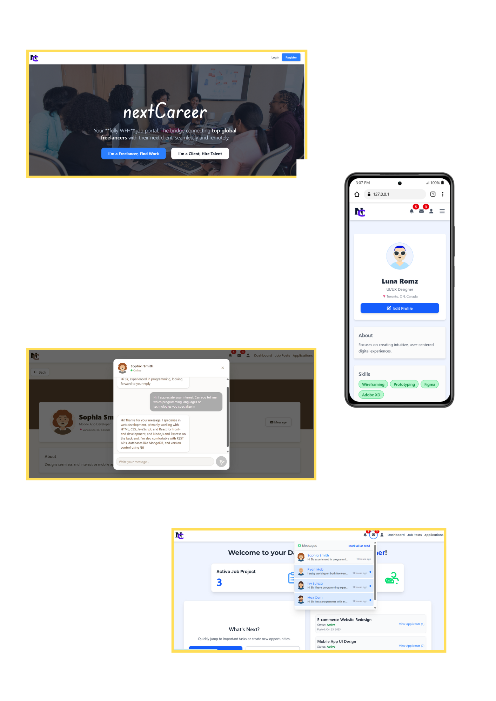

# Job Portal Web Application

## Overview 📌

This Job Portal is a high-performance web application designed to bridge the gap between talented freelancers and visionary employers. By leveraging real-time communication and a streamlined application workflow, the platform ensures that hiring and project bidding are faster and more transparent than ever.

## Sample Website Design Highlight

## Features 📌

- **Freelancer Workspace**
    - **Account Management:** Secure registration and profile setup for freelancers.
    - **Project Discovery:** Browse and filter through available project-based job posts.
    - **Application Tracking:** Apply to projects and monitor the real-time status of applications.
    - **Real-time Interaction:** Receive instant notifications when your application is reviewed, scheduled, or hired.
    - **Integrated Chat:** Direct real-time communication with employers regarding project details.

- **Employer Management**
    - **Project Posting:** Create, edit, and manage detailed job listings.
    - **Applicant Tracking System (ATS):**
        - **Review:** Vet incoming freelancer applications.
        - **Schedule:** Organize interviews or follow-up meetings.
        - **Hired/Reject:** Finalize hiring decisions with one-click status updates.
    - **Application Management:** Centralized dashboard to view all users who applied to specific job posts.

- **Real-time & Communication**
    - **Laravel Reverb:** Powering instant, low-latency WebSocket communication.
    - **Real-time Chat:** Seamless messaging between freelancers and employers.
    - **Live Notifications:** Instant alerts for application updates, new messages, and project interactions.

## Tech Stack 📌

- **Frontend**: Vue.js, Inertia.js
- **Backend**: Laravel
- **Real-time Engine**: Laravel Reverb (WebSockets)
- **Database**: MySQL
- **Styling**: Tailwind CSS (or Bootstrap)

---

### Getting Started

1. Clone the repository.
2. Run `composer install` and `npm install`.
3. Configure your `.env` file for MySQL and Reverb.
4. Run `php artisan migrate`.
5. Start the servers using `php artisan serve` and `npm run dev`.
